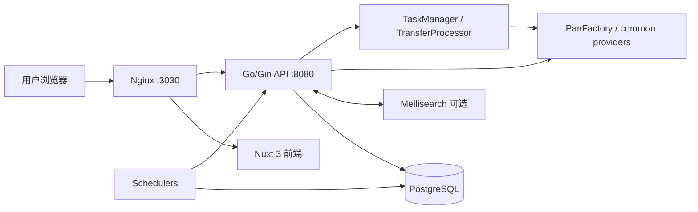
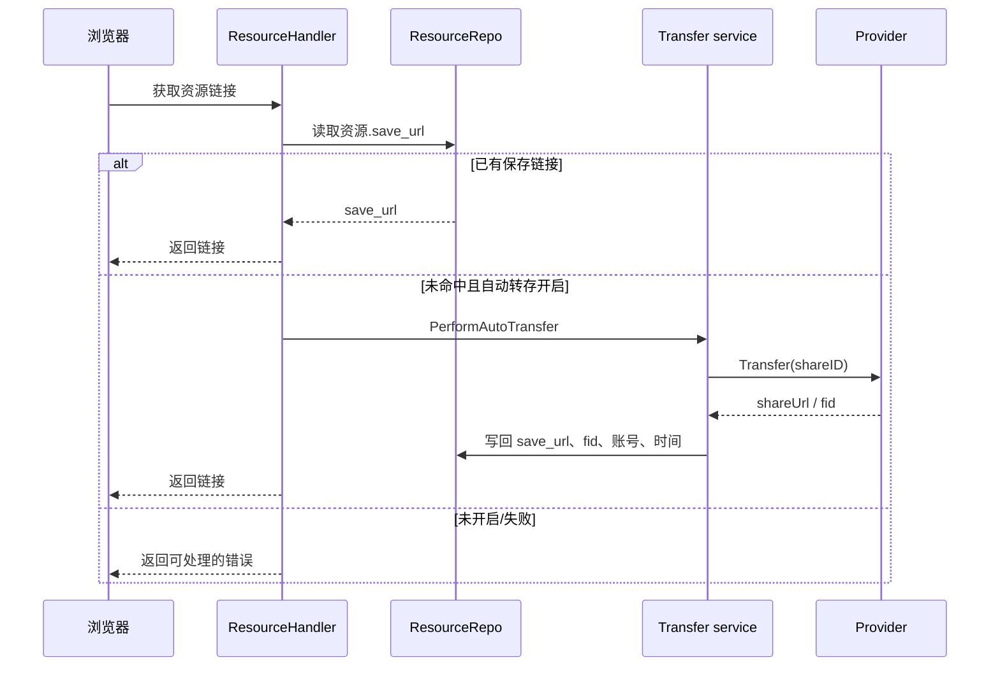

# 架构概览

## 当前系统

- 前端：`web/pages`（首页、资源详情 `/r/[key]`、登录与后台）、`stores`、`composables`；通过 `/api` 访问 Gin。
- 后端：`main.go` 注册路由和依赖；`handlers` 处理 HTTP；`services` 放搜索、链接检测、分享等服务；`db/repo` 为仓储层。
- 数据库：GORM `AutoMigrate`。核心表为 `resources`（原链接、`save_url`、`fid`、有效性）、`pans`、`cks`（账号/容量/Cookie/Extra）、`tasks`/`task_items`、`users`、`search_stats`、`resource_views`、标签与分类；另有报表、投诉、API 日志、插件表。
- 搜索：优先 Meilisearch；未启用、失败或无结果时回退 PostgreSQL/标签查询。索引同步由资源写入路径和管理服务负责。
- 适配器：`common.BasePanService` 和 `PanFactory` 根据链接创建 provider；当前实现文件包括 Baidu、Aliyun、Quark、UC、Xunlei。平台表还预置 Tianyi、123pan、115、other，但不等于均有自动化实现。
- 链接检测：`services/PanCheckClient` 是统一有效性检测入口，依赖外部 PanCheck 部署。
- 认证：用户名/密码（bcrypt）登录，JWT Bearer；管理员路由再经角色中间件保护。

## 当前转存/分享链路

批量转存走 `POST /api/tasks/transfer`，由 `TaskManager`、`TransferProcessor`、`tasks` 和 `task_items` 跟踪；它是进程内任务处理，不是 Redis 队列。

## 推荐增量目标架构

保持当前 `PanFactory`，在资源与现有 `save_url` 之间增加“自有分享记录”（目标平台、账号、状态、失效时间、授权依据、渠道），由任务处理器统一创建并幂等写入；前端详情页只调用新的查询/创建任务 API，不直接暴露原始来源。
